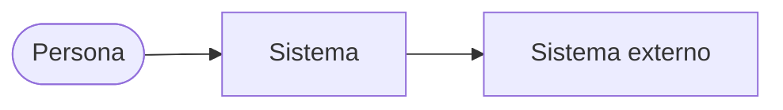
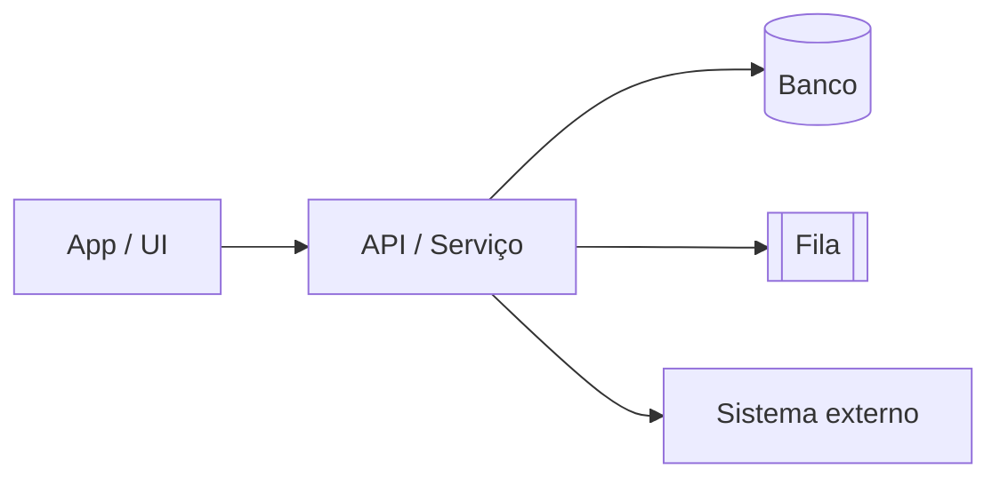
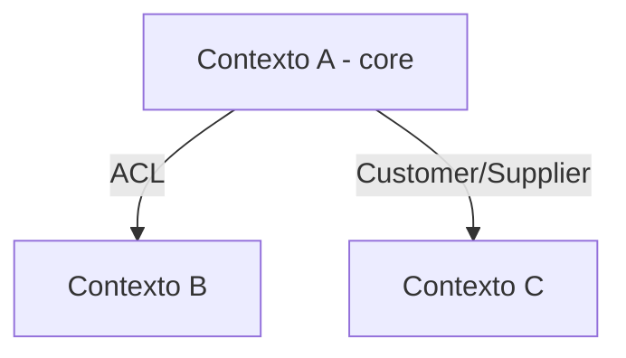

# Diagramas de arquitetura

> Alto nível (C4 L1–L2 + mapa de bounded contexts). Gerado/atualizado por `/diagramar`.
> Renderiza no GitHub e no Claude Code. Mantenha em sincronia com `context-map.md` e os `design.md`.
> Rótulos na linguagem ubíqua do `glossary.md`.

## 1. Contexto do sistema (C4 L1)
> O sistema no centro, com personas e sistemas externos. Sem detalhe interno.

## 2. Containers (C4 L2)
> As peças que rodam (UI, serviços, dados, filas) e como conversam.

## 3. Mapa de bounded contexts (DDD)
> Os contextos do sistema e o padrão de relação entre eles.

<!-- (opcional) 4. Fluxo-chave: uma jornada crítica em sequenceDiagram. -->
